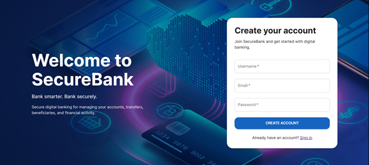
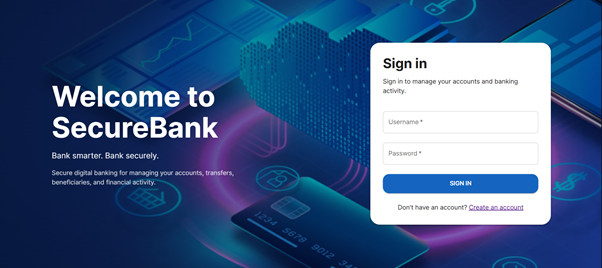
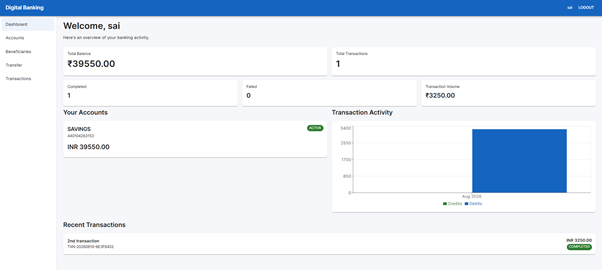
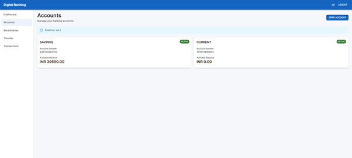
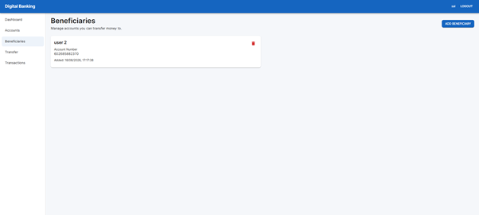
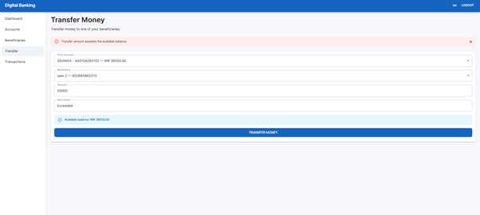
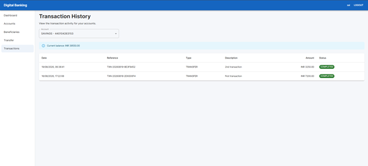

# digital-banking-platform

Full-stack banking platform with secure authentication, microservices, transaction processing, audit logging, and financial analytics.

> **Note:** This project is an educational application and is not intended for production banking or financial transactions.

## Overview

Digital Banking Platform is a full-stack banking application built to demonstrate practical software engineering across secure authentication, account management, financial transaction processing, microservice communication, concurrency handling, auditability, and React-based financial dashboards.

The application is designed around clear service boundaries:

```text
React + TypeScript :5173
          |
          v
API Gateway :8080
          |
    +-----+-------------+----------------+
    |                   |                |
    v                   v                v
Auth Service       Account Service   Transaction Service
   :8081               :8082              :8083
    |                   |                |
    v                   v                v
 auth_db            account_db       transaction_db
                                      |
                                      v
                                  audit_logs
```

## Key Features

### Authentication & Security

- User registration and login
- BCrypt password hashing
- JWT access tokens
- Refresh tokens
- Logout and refresh-token revocation
- JWT Resource Server validation
- `ROLE_USER` and `ROLE_ADMIN`
- Protected APIs and role-based authorization
- Frontend protected routes
- Automatic `401 → refresh → retry` flow
- Service-to-service authentication using an internal service secret

### Customer & Account Management

- Customer profile creation and retrieval
- Savings and Current account creation
- Account balance and status
- Account ownership enforcement
- User-specific account access
- Beneficiary creation, viewing, and deletion
- Duplicate beneficiary protection
- Own-account beneficiary protection
- Beneficiary account validation

### Transaction Engine

- Account-to-account transfers
- Transaction reference generation
- `PENDING`, `COMPLETED`, and `FAILED` transaction states
- Insufficient-balance validation
- Account status validation
- Same-account transfer prevention
- Idempotency using `Idempotency-Key`
- Duplicate-request protection
- Concurrency-safe balance updates
- Transaction history
- Ownership-protected transaction history
- Structured error handling

### Auditability

Transfers generate audit records for:

```text
TRANSFER_INITIATED
TRANSFER_COMPLETED
TRANSFER_FAILED
```

Audit records include relevant information such as:

- User ID
- Action
- Transaction reference
- Status
- Message
- Timestamp

### Frontend

- React + TypeScript
- Material UI
- Responsive application layout
- Login and registration
- Customer dashboard
- Account management
- Beneficiary management
- Transfer flow
- Transaction history
- Recharts-based transaction analytics
- Admin dashboard
- Loading, error, and empty states
- Centralized Axios API client
- Automatic JWT handling

### Admin Dashboard

Admin users can view platform-level statistics including:

- Total users
- Total customers
- Total accounts
- Active accounts
- Total active balance
- Total transactions
- Completed transactions
- Failed transactions
- Transaction volume

Admin statistics APIs are protected server-side with `ROLE_ADMIN`.

## Technology Stack

### Backend

- Java 21
- Spring Boot
- Spring Security
- Spring Security OAuth2 Resource Server
- JWT
- Spring Data JPA
- Hibernate
- Spring Cloud Gateway
- REST APIs
- Bean Validation
- Maven
- PostgreSQL

### Frontend

- React
- TypeScript
- Vite
- Axios
- React Router
- Material UI
- Recharts

### Testing

- JUnit 5
- Mockito
- Spring Boot Test
- Postman
- Vitest
- React Testing Library
- `@testing-library/user-event`

## Services

### Auth Service — `:8081`

Owns authentication and identity-related functionality.

```text
POST /api/auth/register
POST /api/auth/login
POST /api/auth/refresh
POST /api/auth/logout
GET  /api/auth/me
GET  /api/admin/user-stats
```

Responsibilities:

- Users
- Roles
- Password hashing
- JWT access tokens
- Refresh tokens
- Logout/revocation
- Authentication and authorization

### Account Service — `:8082`

Owns customer, account, balance, and beneficiary data.

```text
POST /api/customers
GET  /api/customers/me

POST /api/accounts
GET  /api/accounts
GET  /api/accounts/{id}

POST   /api/beneficiaries
GET    /api/beneficiaries
GET    /api/beneficiaries/{id}
DELETE /api/beneficiaries/{id}

GET /api/admin/account-stats
```

Internal service endpoints are kept separate from public Gateway routes.

### Transaction Service — `:8083`

Owns transaction processing, transaction history, and audit events.

```text
POST /api/transactions/transfers
GET  /api/transactions/account/{accountId}
GET  /api/admin/transaction-stats
```

The transfer flow is:

```text
React
  ↓
API Gateway
  ↓
Transaction Service
  ↓
Account Service
  ↓
Validate + lock accounts
  ↓
Debit source
  ↓
Credit destination
  ↓
Persist transaction status
  ↓
Write audit event
```

### API Gateway — `:8080`

The frontend uses the Gateway as the single backend entry point.

Responsibilities:

- Service routing
- Admin route forwarding
- CORS configuration
- Browser preflight handling
- Service endpoint abstraction

Frontend requests should go through:

```text
http://localhost:8080
```

rather than directly calling individual backend services.

## Database Design

The application uses logically separate PostgreSQL databases:

```text
auth_db
account_db
transaction_db
```

This follows the database-per-service ownership model.

### Auth DB

```text
users
roles
refresh_tokens
user_roles
```

### Account DB

```text
customers
accounts
beneficiaries
```

### Transaction DB

```text
transactions
audit_logs
```

Services communicate through APIs rather than directly accessing another service's database.

## Security Model

### JWT

Protected requests use:

```http
Authorization: Bearer <access-token>
```

The frontend automatically attaches the access token through Axios.

### Role-Based Authorization

```text
ROLE_USER
ROLE_ADMIN
```

Frontend routing improves the user experience, but the backend remains the actual security boundary.

For example:

```text
ROLE_USER
  ↓
/admin/dashboard
  ↓
403 / redirected UI

ROLE_ADMIN
  ↓
/admin/dashboard
  ↓
allowed
```

### Internal Service Authentication

Account Service internal transfer/ownership endpoints are protected with an internal service secret and are not exposed as normal frontend endpoints.

## Idempotency

Transfers require:

```http
Idempotency-Key: <unique-key>
```

Example:

```text
Request 1
    ↓
Transfer executed

Request 2 with same key
    ↓
Existing transaction returned
    ↓
No duplicate debit
```

The frontend generates one unique key for each logical transfer attempt.

## Concurrency & Balance Consistency

The transaction flow uses database transaction boundaries and account locking to prevent race conditions during concurrent balance updates.

The key business requirement is:

```text
Two simultaneous transfers
        ↓
Both read the same balance
        ↓
Must NOT both spend the same funds
```

Account balance updates are therefore protected at the database/service layer.

## Transaction History

Users can view account-specific transaction history through:

```text
GET /api/transactions/account/{accountId}
```

History is:

- Ownership protected
- Sorted newest first
- Available to both sender and receiver for participating accounts

## Swagger / OpenAPI

Swagger/OpenAPI is available for the services.

Typical local URLs:

```text
Auth Service:
http://localhost:8081/swagger-ui/index.html

Account Service:
http://localhost:8082/swagger-ui/index.html

Transaction Service:
http://localhost:8083/swagger-ui/index.html
```

Swagger supports Bearer JWT authorization for protected endpoints.

## Frontend

Run the frontend from the `frontend` directory.

### Install

```bash
npm install
```

### Environment

Create:

```text
frontend/.env
```

with:

```env
VITE_API_BASE_URL=http://localhost:8080
```

No backend secrets should be placed in the frontend environment file.

### Development

```bash
npm run dev
```

Frontend:

```text
http://localhost:5173
```

### Build

```bash
npm run build
```

### Frontend Tests

```bash
npm run test:run
```

## Backend Setup

Each service is an independent Maven application.

Typical commands:

```bash
mvn clean test
```

and:

```bash
mvn spring-boot:run
```

Database credentials and service secrets should be supplied through local environment variables or IDE run configurations.

Important backend environment values include:

```text
DB_PASSWORD
JWT_SECRET
INTERNAL_SERVICE_SECRET
```

Do not commit real secrets to Git.

## Suggested Local Startup Order

```text
1. PostgreSQL
2. Auth Service       :8081
3. Account Service    :8082
4. Transaction Service :8083
5. API Gateway        :8080
6. React Frontend     :5173
```

## Testing Strategy

### Backend

Automated service-layer tests cover important transaction/business rules such as:

- Successful transfer
- Business failures
- Account Service unavailable
- Idempotency
- Missing idempotency key
- Same source/destination
- Invalid transfer amount
- Decimal precision validation

Additional manual/API verification was performed through Postman for:

- Registration
- Login
- Refresh
- Logout
- `/api/auth/me`
- Customer/account operations
- Beneficiaries
- Transfers
- Transaction history
- Audit logging
- Admin authorization

### Frontend

Critical frontend tests cover:

- Authentication context
- Protected routes
- Admin routes
- Login behavior
- Transfer form behavior
- Beneficiary account ID mapping
- Idempotency key generation
- Balance validation
- Dashboard rendering
- Analytics empty states
- Failed transaction display

## Current Project Status

```text
Phase 1 — Authentication & Security        ✅
Phase 2 — Account Management               ✅
Phase 3 — Transaction Engine               ✅
Phase 4 — Frontend Integration             ✅
Phase 5 — Docker / Deployment              ✅
Phase 6 — Workflow Refinement / v2         ⏳
```

The current version is deployed as a portfolio/demo application. Phase 5 completed local Dockerization, Render backend deployment, Render PostgreSQL deployment, Vercel frontend deployment, production CORS configuration, and live integration verification.

The next planned iteration focuses on **core banking workflow completeness and UX correctness**, not adding unrelated technologies.

The core full-stack banking application is complete.

## Git Workflow

The project uses feature branches and pull requests.

Typical flow:

```text
feature/<work>
      ↓ PR
develop
      ↓ PR
main
```

Major completed work was developed through feature branches and merged through pull requests.

The Docker/deployment work followed the same process and was merged into `develop` before the final production deployment.

## Screenshots

### 1. User Registration
User sign-up screen with username, email, and password fields under the SecureBank portal.


---

### 2. User Sign In
Authentication screen for existing users to log in securely using credentials.


---

### 3. Customer Dashboard
Overview screen showing total balance, transaction summary, active accounts, transaction analytics charts, and recent activity.


---

### 4. Account Management
View of registered user accounts showing account types (Savings/Current), active status, and available balances with options to open new accounts.


---

### 5. Beneficiary Management
List of saved payees/beneficiaries with account numbers, creation timestamps, and management options.


---

### 6. Transfer Flow & Validation
Money transfer interface showing source account selection, beneficiary destination, and client-side balance validation handling insufficient funds.


---

### 7. Transaction History
Detailed, sortable list of account-level transfers displaying references, transaction types, descriptions, amounts, and statuses.


## Known Workflow Gaps & Planned v2 Refinement

The current release demonstrates the core banking architecture, but a few **basic workflow behaviors** should be refined before treating the application as a more complete digital-banking product.

### Account Funding

Newly opened accounts currently start with a zero balance. This is technically consistent with account creation, but it makes the first real transfer workflow impossible unless test data is manually funded.

Planned refinement:

```text
Account opened
      ↓
Opening balance / funding workflow
      ↓
Available balance
      ↓
Transfer becomes immediately usable
```

A proper funding mechanism should be explicitly designed and audited rather than relying on direct database updates for demonstrations.

### Failed Transaction Reachability

The backend supports `FAILED` transactions and audit events, but the current frontend prevents an insufficient-balance transfer before it reaches the backend.

Planned refinement:

```text
Client validation
      ↓
Backend business validation
      ↓
Persist FAILED transaction when appropriate
      ↓
Persist TRANSFER_FAILED audit event
      ↓
Display failure outcome to user
```

The UI should retain useful client-side validation while still allowing meaningful backend failure paths to be exercised and represented consistently.

### Onboarding / Empty-State Flow

A newly authenticated user without a customer profile currently produces resource-not-found responses that can surface as generic loading/error states.

Planned refinement:

```text
Authenticated user
      ↓
No customer profile?
      ↓
Show onboarding prompt
      ↓
Create customer profile
      ↓
Open account
```

The same principle should be applied to accounts, beneficiaries, and transfer readiness.

### Live / Demo Data

The portfolio deployment currently uses separate cloud data from local development. A clean demo should provide either:

- a guided onboarding/funding path,
- safe seed/demo data,
- or a clearly documented demo setup procedure.

Direct SQL balance changes should remain a development/testing technique, not the normal user workflow.

### Basic Banking Product Completeness

Before adding advanced technologies, the next release should consider these core capabilities where appropriate:

- Account funding / deposit flow
- Withdrawal or debit workflow with appropriate business rules
- Clear account lifecycle states
- Account activation / closure handling
- Standard transaction failure semantics
- Better transfer failure messaging
- User-friendly onboarding for incomplete profiles
- Consistent confirmation and receipt information
- Stronger transaction detail view
- Basic statement/history filtering
- Basic account and beneficiary presentation polish
- Auditability for balance-changing operations

## Future Enhancements

### Core Workflow Refinement — next version

These are the next priorities because they improve the **basic banking workflow**, not because they add more technology:

- Account funding / opening-balance workflow
- Backend-reachable failed transaction scenario
- Better failed-transfer and business-error UX
- Guided onboarding when customer/profile data is missing
- Account lifecycle improvements: activate, freeze, close where appropriate
- Basic deposit/withdrawal support with auditability
- Clear transaction detail / receipt view
- Basic transaction filters by date, status, and type
- Better live/demo data setup
- Consistent empty/loading/error states across all banking pages
- Mobile-friendly polish for the most important banking flows
- Login/register visual branding such as a banking-themed background or hero treatment
- Production-friendly handling of Render cold starts and retryable 502/503 responses
- User-facing confirmation for high-impact operations
- Clear balance update feedback after transfers

### Advanced / optional

Only consider these after the core workflow is reliable:

- Redis caching
- Rate limiting
- Email/SMS notifications
- Kafka/event-driven processing
- Account statements and exports
- Scheduled transfers
- GitHub Actions CI/CD
- Full browser end-to-end automation
- Testcontainers
- Stronger observability/metrics

## Project Principle

The value of this project is in being able to explain:

> **Why the services are separated, how authentication works, how a transfer is processed, how duplicate and concurrent requests are handled, how balances remain consistent, how authorization is enforced, how activity is audited, how the frontend integrates with the Gateway, and how the system is tested.**

---

**Educational Disclaimer**

This project is an educational application and is not intended for production banking or financial transactions.
